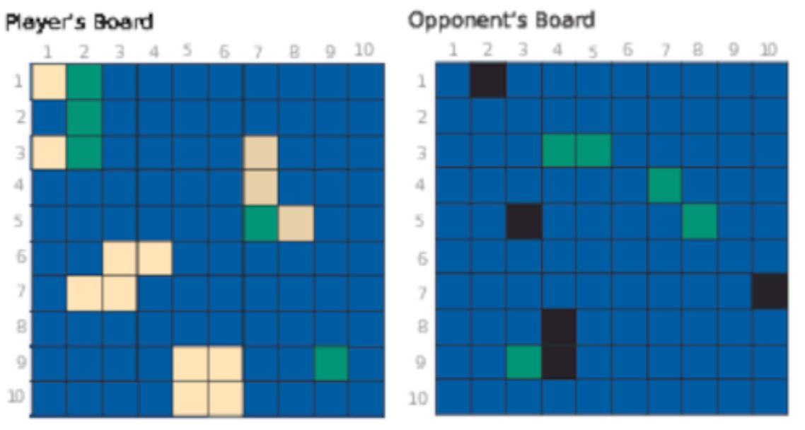

# Functional Web Development with Elixir, OTP, and Phoenix

https://pragprog.com/book/lhelph/functional-web-development-with-elixir-otp-and-phoenix

### Online Resources

- https://pragprog.com/titles/lhelph/source_code
- https://pragprog.com/titles/lhelph/errata
- https://pragprog.com/titles/lhelph/release_info

### 1. Mapping Our Route

Data structures, functions, and modules.

#### The Game of Islands

It’s a game for two players, and each player has a board, which consists of a
grid of one hundred coordinates. The grid is labeled with the numbers 1
through 10 across the top for the columns and down the left side for the
rows. We name individual coordinates with this row-column combination.

The players cannot see each other’s boards.

The players have matching sets of islands of various shapes and sizes, which
they place on their own boards. The players can move the islands around as
much as they like until they say that they are set. After that, the islands
must stay where they are for the rest of the game.

Once both players have set their islands, they take turns guessing
coordinates on their opponent’s board, trying to find the islands. For every
correct guess, we plant a palm tree on the island at that coordinate. When
all the coordinates for an island have palm trees, the island is forested.

The first player to forest all of her opponent’s islands is the winner.

### Part I. Define the Functional Core in Elixir

### 2. Model Data and Behavior

- model domain elements as Elixir datatypes
- define behavior as data transformation

#### Let’s Build It

[:ship: 3548a93](https://github.com/arafatm/book_functional_web_development_with_elixir_otp_and_phoenix/commit/3548a93)
`$ mix new islands_engine --sup` #

```
$ tree
.
├── README.md
├── config
│   └── config.exs
├── lib
│   ├── islands_engine
│   │   └── application.ex
│   └── islands_engine.ex
├── mix.exs
└── test
├── islands_engine_test.exs
└── test_helper.exs
```

#### Discover the Entities and Model the Domain



2 Boards, 1 for each player. Data structures we choose will need to support
these actions as well:
- Players need to be able to position islands on their own boards.
- Players need to be able to guess coordinates on their opponent’s boards.
- The game needs to determine if a guess results in a hit or a miss.
- The game needs to determine if a guess results in a forested island.
- The game needs to determine if a guess results in a win.

Can use **tuple** `{1,1}`; Hard to encode as JSON

Can use **map** `%{row: 1, col: 1}`. Good encapsulation and easy to pattern match.

3rd option is to use **struct**. 
- similar to map
- offer compile time checks on keys
- runtime checks on type

[:ship: 8023eee](https://github.com/arafatm/book_functional_web_development_with_elixir_otp_and_phoenix/commit/8023eee)
Coordinate module that aliases itself
- Allows `%Coordinate{}` instead of `%IslandsEngine.Coordinate{}`

[:ship: e6364e0](https://github.com/arafatm/book_functional_web_development_with_elixir_otp_and_phoenix/commit/e6364e0)
define a struct with row and col keys with `@enforce_keys`

```iex
$ iex -S mix

# Let’s alias the module to save some typing:
iex> alias IslandsEngine.Coordinate 
IslandsEngine.Coordinate

# If we create a new coordinate with valid row and column values, we get a full
# coordinate struct back:
iex> Coordinate.new(1, 1)
{:ok, %IslandsEngine.Coordinate{col: 1, row: 1}}

# If we give it values that are off the board, though, we get back an error:
iex> Coordinate.new(-1, 1)
{:error, :invalid_coordinate}
 	
iex> Coordinate.new(11, 1)
{:error, :invalid_coordinate}

# If we try to create a coordinate struct manually without both keys, we’ll get
# an error:
iex> %Coordinate{row: 5}
** (ArgumentError) the following keys must also be given when building struct
		IslandsEngine.Coordinate: [:col]
		(new_islands) expanding struct: IslandsEngine.Coordinate.__struct__/1
									iex:4: (file)
```

xxx
#### Transforming Data
#### Putting the Pieces Together
#### Wrapping Up

### 3. Manage State with a State Machine
#### A Quick Look at State
#### A Bit of History
#### State Machines
#### A Functional State Machine for Islands
#### Working Through the States
#### Wrapping Up

## Part II. Add OTP for Concurrency and Fault Tolerance

### 4. Wrap It Up in a GenServer
#### A Look at Micro-Services
#### OTP Solutions
#### Getting Started with GenServer
#### Initializing GenServer State
#### Customizing GenServer Behavior
#### Naming GenServer Processes
#### Wrapping Up

### 5. Process Supervision for Recovery
#### Fault Tolerance
#### Linking Processes
#### Introducing the Supervisor Behaviour
#### Supervision Strategies
#### The Child Specification
#### A Supervisor for the Game
#### Starting the Supervision Tree
#### Starting and Stopping Child Processes
#### Putting the Pieces Together
#### Recovering State After a Crash
#### Wrapping Up

## Part III. Add a Web Interface with Phoenix

### 6. Generate a New Web Interface with Phoenix
#### Frameworks
#### Applications
#### Generate a New Phoenix Application
#### Adding a New Dependency
#### Call the Logic from the Interface
#### Wrapping Up

### 7. Create Persistent Connections with Phoenix Channels
#### The Beauty of Channels
#### The Pieces That Make a Channel
#### Let’s Build It
#### Establish a Client Connection
#### Converse Over a Channel
#### Connect the Channel to the Game
#### Phoenix Presence
#### Authorization
#### Wrapping Up

### A1. Installing System Dependencies

#### Elixir
#### Erlang
#### Phoenix
#### Node.js and NPM
#### Bibliography
